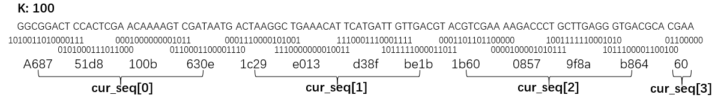
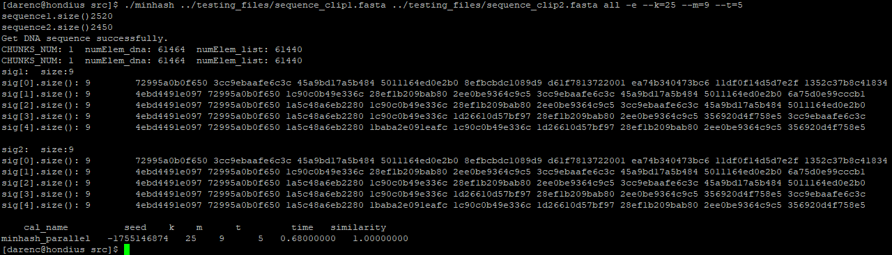
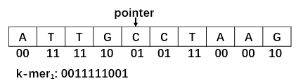
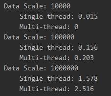

# MinhashSketch

## Description

### Subsequence

We use a pointer to access sequence, which need noly to record the last base read, and directly assign four bases(A, C, T, G) to four kinds of 2-bit values in binary. 
If the length of the subsequence exceeds 32 (i.e. one uint64 is not enough to indicate the length of subsequences), we need to use more than one ([k / 32] + 1) uint64 to store subsequences.

For example, k is 100 here:

### Running Example

Parameter configuration: 

1. k = 10
2. m = 5
3. t = 10

<pr>

## Improvements (July 11)
When meeting with Prof. Buhler, I got several tips about the implement.

### Simplify the process of taking k-mers subsequence

I used hash template struct of STL to transfer sequence of DNA to integer before. 
This will cost O[k*(l-k+1)] complexity to get each base and O(l-k+1) to caculate hash values totally which is terrible inefficient. 

We can use a pointer to access this sequence, and directly assign four bases(A, C, T, G) to four kinds of 2-bit values in binary.

Such as:
 
k is 5 here.

You will get the first k-mer subsequence, ATTGC, then transfer to 0011111001 in binary. Then move pointer to next pot. Then you can get the second k-mer, TTGCC. What you need to do now is left shift 2 bits of last k-mer in binary and add the 2-bit values in binary of new base.

As a result, you only need O(l-k+1) take-operations and no hash operations to transfer sequence to integer.

### Save maximum value in heap

Since m(number of smallist values you want) is much smaller than the sequence length, the hash value we get is greater than the maximum value in the heap in most cases. 

So if we insert and pop the new value into the heap every time, the complexity will be O[log(m)*(l-k+1)]. But if we save the maximum of this heap, the complexity tends to be O(l-k+1).

### Change to a more reasonable hash function system

Our hash function was ((a * x + b) % p) % m, all calculated using unsigned longs (uint64), where a and b is random values, p is prime and m is maximum of hash values. 

Later I found some better hash functions to produce well-distributed 64 or 128-bit hash values for byte arrays of any length, such as [SpookyHash [2012 Bob Jenkins]](http://burtleburtle.net/bob/hash/spooky.html) and [CityHash [2011 Google, Inc.]](https://github.com/google/cityhash). I chose SpookyHash because CityHash requires CRC32 instruction in your machine's chips. 

> SpookyHash is a public domain noncryptographic hash function producing well-distributed 128-bit hash values for byte arrays of any length. It can produce 64-bit and 32-bit hash values too, at the same speed, just use the bottom n bits. The C++ reference implementation is specific to 64-bit x86 platforms, in particular it assumes the processor is little endian. 

Then I just need to give one seed and the length (i.e. k) to SpookyHash to get a hash values.

**It should be noted that the subsequence we take out is represented by uint64, so if the value of k (i.e. length of subsequence) is greater than 32, we need to save the substring in an array.**

## Improvements (July 17)
After talking with Prof. Buhler, I got several tips about the implement. 

### Radix Sort

Radix sort is fast to deal with this kind of problem - to get the minimum m values of a bunch of numbers with equal length.

Firstly, I wrote a multi-thread radix sort program. I found that multi-thread program does not have a single threaded program faster. This is because if the CPU is Running at full load, multi-thread program wastes time because of data partitioning and thread switching, etc.

### Blocks

We could use radix sort to get m scetches rather than heaps. Consequently, split sequence (all hash values) to **p** blocks and use **p** processors to handle these in parallel. 

In order to simulate the situation where the GPU processes blocks in parallel, I first write it as a multi-thread program, treating each thread as a different processor, and they execute a same function to simulate SIMD.

-------------------
It is a project when I was internship at the University of Washington in St. Louis under the guidance of [Prof. Buhler](https://www.cse.wustl.edu/~jbuhler/).

 