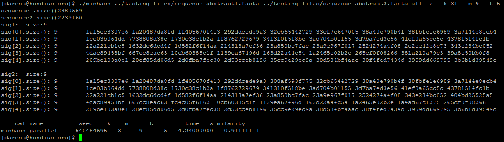

# MinhashSketch

It is a project when I was internship at the University of Washington in St. Louis under the guidance of [Prof. Buhler](https://www.cse.wustl.edu/~jbuhler/).

[What is MinhashSketch](#What_is_MinhashSketch)

## What is MinhashSketch

It's a program which implements a parallel algorithm to get  minhash sketches with DNA sequence as input under [CUDA](http://supercomputingblog.com/cuda-tutorials/) and [CUB](https://nvlabs.github.io/cub/).  

[Minhash](https://en.wikipedia.org/wiki/MinHash) is a technique for quickly estimating how similar two sets are. For More information of similarity and minhash sketch, you can see [Class Note 24](https://classes.engineering.wustl.edu/cse584a/notes/class24.pdf) and [Class Note 25](https://classes.engineering.wustl.edu/cse584a/notes/class25.pdf) of Prof. Buhler.

### Steps

In general, the program divides the long DNA sequence into sevelral CHUNKs and cope with them respectively. For each CHUNK, it will get hash velues, radix sort, mark, scan and merge in GPU. 

### Input

1. **DNA sequence**. (e.g. we used [E.coli K12 genome](https://www.ncbi.nlm.nih.gov/nuccore/NZ_CP010438.1?report=fasta) as experimental data)
2. **k**: The length of subsequences (or [k-mers](https://en.wikipedia.org/wiki/K-mer)). 
3. **m**: The number of sketches stored. 
4. **t**: The number of hash functions. 

### Output

The output should be the minhash sketch of input DNA sequences and the similarity of them. 

<pr>

### File structure

	MinhashSketch
	|
	|-- src
	|   |-- main.cu		  # Main function and help, usage functions
	|   |-- MinhashSketch.cu   # Key file for generating minhash sketches
	|   |-- Utils.cu   	  # Some utilities
	|   |-- Utils.h       
	|   |-- Hash.cu   	  # Generate hash funtions or random parameters
	|   |-- Hash.h    	  
	|   |-- SpookyV2.cu   # SpookyHash function for host
	|   |-- SpookyV2.h
	|   |-- SpookyV2_d.cu # SpookyHash function for device
	|   |-- SpookyV2_d.h
	|   
	|-- testing_files     # Save files of DNA sequences

The first line of DNA files should be the file information, followed by the DNA sequence from the second line.

## Function Documentation

The key functions are all in **MinhashSketch.cu**. 

### genSig

	signature genSig(const int k, const int m, const int t, 
					char \*dnaList, int length, uint64 \*hashes\_b);

This is a host window function. 
The input parameters, **k**, **m** and **t**, have been explained before. 
DNA sequence is stored in **dnaList**, where **length** is the number of bases.
The **hashes\_b** is a set of random numbers between 0 and UINT64\_MAX. 
And the type of return values is defined as follows, whose first dimension represents hash functions and second dimension represents minhash sketches.

	typedef vector<vector<uint64>> signature;

In this function, firstly, you can set three values, **BLOCKS\_NUM**, **BLOCK\_THREADS** and **ITEMS\_PER\_THREAD** according your GPU. (e.g. I set BLOCKS\_NUM = 16, BLOCK\_THREADS = 32 * 16, ITEMS\_PER\_THREAD = 4 here)

Then it calculate how many **CHUNKS** are needed and the starting index of each chunk.

Then we cope with each chunk of each hash function separately. (Hash function here means different random parameter **hashes\_b**, because SpookyHash need a seed only) 

The process of each CHUNK includes **getBlockSketch** and **getAllSketch**, which you will see information of below.

### getBlockSketch

	template<int BLOCK_THREADS, int ITEMS_PER_THREAD>
	__global__ void getBlockSketch (const int k, const int m, char *dna_d, 
			uint64 *input_d, int numElem_dna, int numElem_list, uint64 hash_b);

This device function could get minhash values of each block. 
The input parameters, **k** and **m**, have been explained before. 
DNA sequence is stored in **dna\_d**, 
where **numElem\_dna** is the length of it.
The **input\_d** stores hash value list, sorted list and minhash sketch list, 
where **numElem\_list** is the length of it.
The **hash\_b** is a random number between 0 and UINT64\_MAX. 

In this function, we first get hash value list using **BlockGetHashValues**, which is descripted detailedly later. 

Then, we use primitives of [CUB](https://nvlabs.github.io/cub/index.html) to **radix-sort** hash value list, **mark discontinuity**, **scan mark list** for the sake of removing duplicated items.  And then, we **write back** and **restore** sorted list into **input\_d**.

### BlockGetHashValues

	template<int BLOCK_THREADS, int ITEMS_PER_THREAD>
	__device__ void BlockGetHashValues (const int k, char *dna_d, int thread_offset, 
							uint64 *thread_dataR, int hash_b);

It is a device function inorder to get hash value list.

We use a pointer to access sequence, which need noly to record the last base read, and directly assign four bases(A, C, T, G) to four kinds of 2-bit values in binary. 
If the length of the subsequence exceeds 32 (i.e. one uint64 is not enough to indicate the length of subsequences), we need to use an array **cur\_seq**[k / 32 + 1] instead of one  uint64 to store subsequences. 

For example, k is 100 here:

### getAllSketch

	template<int BLOCKS_NUM, int BLOCK_THREADS, int ITEMS_PER_THREAD>
	__global__ void getAllSketch (const int m, uint64 *input_d, int numElem_list)

This device function aimed to merge sketches of all blocks. 
The input parameters, **m**, have been explained before. 
The **input\_d** stores minhash sketch list sorted on each block. 
And **numElem\_list** is the length of it.

We first merge the sketches in adjacent blocks, getting half of the previous sketches, then merge the adjacent sketches again, and so on untill one left.

When merging sketches in every two blocks, I provide a method based on [Richard Cole, <i>Parallel Merge Sort</i>, 1986](http://www.inf.fu-berlin.de/lehre/SS10/SP-Par/download/parmerge1.pdf) in order to merge two ordered lists as quickly as possible. The previous algorithm did not solve the problem of duplicate elements in the two lists.

	Input: listA, listB
	definition:
		rank(x|A) : The number of elements in A that are not greater than x.
		rank(B|A) : An array (r1,r2,..., rn), where ri=rank(B[i]:A).
		rank(x|AUB) : The number of elements in AUB that are not greater than x, 
		so, rank(x|AUB) = rank(X|A) + rank(x|B).
	
	Merge two Ordered Lists:
		rankA = rankB = {0, 1, 2, ...}
		dupeA = dupeB = {0, 0, 0, ...}
		for every elements listA[a] in listA:
			Binary search for the index i of the smallest element of listB that 
					are not smaller than x.
			rankA[a] = i
			if listA[a] is equal to listB[i]:
				dupeA[a] = 1
		Do the same process to listB, rankB and dupeB.
		Get scanA and scanB for dupeA and dupeB
		for every i in range(0, m):
			rankA[i] -= scanA[i]
			rankB[i] -= scanB[i]
		for every i in range(0, m):
			if rankA[i] < m: 
				list_output[rankA[i]] = listA[i]
			if rankB[i] < m: 
				list_output[rankB[i]] = listB[i]

In this way, we can use at least (2 * m) thread to solve the two-list-merge problem in O(log(m)) time. 

## Example

If you want to compile the program, follow the instructions below:

	Compile
	$ nvcc -std=c++11 -I /export/project/hondius/opt/cub -rdc=true main.cu Utils.cu Hash.cu SpookyV2_d.cu -o minhash

	Run
	$ ./minhash ../testing_files/sequence_abstract1.fasta ../testing_files/sequence_abstract2.fasta all -e --k=5 --m=10 --t=10

Or if you want to use **MinhashSketch.cu**, this an example about how to use it:

	#include "MinhashSketch.cu"
	#include "Hash.h"
	#include "Utils.h"

	int k, m, t;
	char *dnaList1, *dnaList2;
	(Get k, m, t, dnaList1, dnaList2)
	uint64 *hashes_b = generateHashes_b(t, seed);
    vector <vector<uint64>> sig1 = genSig(k, m, t, dnaList1, length1, hashes_b);
    vector <vector<uint64>> sig2 = genSig(k, m, t, dnaList2, length2, hashes_b);
	similarity = computeSim(sig1, sig2);

## Process Description

### Divide DNA sequence into several chunks

We pre-defined parameters BLOCKS\_NUM, BLOCK\_THREADS and ITEMS\_PER\_THREAD. Then we can process BLOCKS\_NUM * BLOCK\_THREADS * ITEMS\_PER\_THREAD values at a time, which is also the length of a chunk.

If the length of a chunk is (BLOCKS\_NUM * BLOCK\_THREADS * ITEMS\_PER\_THREAD), the length of a sebsequence of DNA is (BLOCKS\_NUM * BLOCK\_THREADS * ITEMS\_PER\_THREAD + k - 1). And the number of chunks is 

	if (length % (BLOCKS_NUM * BLOCK_THREADS * ITEMS_PER_THREAD) == 0)
        CHUNKS_NUM = (length - k + 1) / (BLOCKS_NUM * BLOCK_THREADS * ITEMS_PER_THREAD);
    else
        CHUNKS_NUM = (length - k + 1) / (BLOCKS_NUM * BLOCK_THREADS * ITEMS_PER_THREAD) + 1;

### Merge Between Blocks

In general, merge two ordered lists into one need O(m + n) time complexity. But we could use a efficient algorithm to merge two ordered lists with O(log(n)). 

	Given two ordered Lists A and B
	rank(x | A) : The number of elements in A that are not greater than x.
	rank(B | A) : An array (r1,r2,..., rn), where ri = rank(B[i]:A).
	rank(x | AUB) : The number of elements in the AUB that are not greater than x, so rank(x | AUB) = rank(X | A) + rank(x | B).
	Further : rank(A | AUB)= rank(A | A) + rank(A | B).

rank(A | AUB) is offset vector of elements in A.
We could get rank(A | AUB) and rank(B | AUB) with time complexity O(log(n)), where n is number of elements in A (or B). 
Then write back m smallest values according to offset.

And I considered the duplicating situation, that is, there are values in the two lists are duplicates. In this case, we can give it a mark, do not write back and then reduce the offset of values which bigger than that the mark value by one.  

-------------------
It is a project when I was internship at the University of Washington in St. Louis under the guidance of [Prof. Buhler](https://www.cse.wustl.edu/~jbuhler/).

 